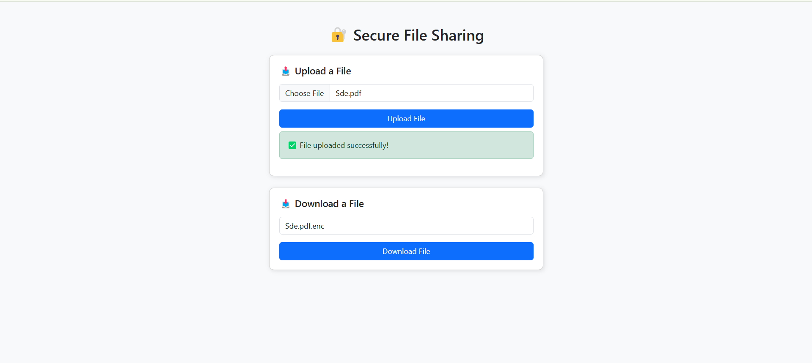

# 🔐 Secure File Sharing System

A **Flask-based encrypted file sharing system** that allows users to securely **upload and download files** with AES encryption.  

⚠️ **Currently, this project runs locally**. To make it accessible over the internet, deploy it on **AWS, Render, or Heroku** (instructions below).  

## 🚀 Features
✅ **AES Encryption** – Securely encrypts uploaded files.  
✅ **Local File Storage** – Files are stored on the local machine.  
✅ **Modern UI** – Built with Bootstrap for a clean design.  
✅ **Error Handling** – Alerts for missing files or incorrect inputs.  

## 📸 Preview  
  

